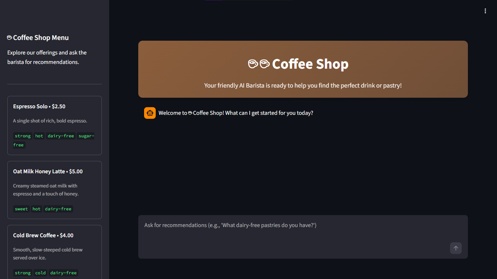

# ☕ Coffee Barista Agent – Production RAG Microservice

A production-ready **Retrieval-Augmented Generation (RAG)** AI Barista microservice built with **Python**, **Google ADK**, **Streamlit**, **Cloud Firestore Vector Search**, and **Vertex AI Embeddings** (`text-embedding-005`), fully containerized and deployed on **Google Cloud Run**.

---

## 🚀 Live Demo & Project Links

* **GitHub Repository:** [krithikashree1957/coffee-barista-agent](https://github.com/krithikashree1957/coffee-barista-agent)
* **Cloud Run Deployment:** [Coffee Barista Live Instance](https://coffee-barista-463652007742.asia-south1.run.app)

> **Note for Recruiters & Technical Reviewers:** The live Cloud Run instance is hosted via a temporary GCP trial environment. If the live link is inactive or spun down, please review the complete end-to-end execution, guardrail validations, and dynamic database updates detailed in the **Visual Verification & Test Scenarios** section below.

---

## 🛠️ Tech Stack & Key Technologies

* **Language & Framework:** Python 3.11+, Streamlit
* **Agent Framework:** Google Agent Development Kit (ADK)
* **Vector Database:** Google Cloud Firestore (Native Vector Search with Cosine Distance)
* **Embedding Model:** Vertex AI `text-embedding-005` (768 dimensions)
* **LLM Engine:** Gemini 2.5 / Vertex AI Enterprise Integration
* **Infrastructure & Deployment:** Google Cloud Run, Cloud Build, Docker, GCP IAM

---

## 💡 Architecture & Key Features

1. **Vector-Grounded Retrieval (RAG):** Replaces static JSON menu lookup with real-time Firestore nearest-neighbor cosine similarity queries over 768-dimensional embeddings.
2. **Dynamic Database Synchronization:** Menu updates in Firestore instantly reflect on the Streamlit UI and agent knowledge base without requiring service redeployments.
3. **Out-of-Menu Guardrails:** Uses strict system instructions to prevent hallucinating non-existent items.
4. **Allergen & Preference Intelligence:** Reasonably filters items based on user constraints (e.g., lactose intolerance, dairy-free preferences).

---

## 🧪 Visual Verification & Test Scenarios

All test runs below correspond to the visual assets stored in [`assets/`](assets/):

### 1. Main Application Interface
Overview of the live Streamlit dashboard rendering the dynamic menu sidebar alongside the interactive AI Barista chat window.



---

### 2. In-Menu Similarity Retrieval
* **User Query:** *"Recommend something strong and warm."*
* **Vector Query Result:** Cosine search matches with `Espresso` ($2.50).
* **Agent Output:** Successfully identifies and recommends Espresso based on flavor and temperature context.


---

### 3. Out-of-Menu Guardrail Enforcement
* **User Query:** *"Do you have a matcha frappuccino?"*
* **Vector Query Result:** Low similarity score; item absent from Firestore collection.
* **Agent Output:** Politely informs the customer that Matcha Frappuccino is not available.


---

### 4. Allergen-Aware Constraint Handling
* **User Query:** *"I'm lactose intolerant, what can I get?"*
* **Agent Output:** Filters items to return strictly dairy-free options (e.g., Oat Milk Latte, Espresso, Cold Brew) while omitting dairy items like Cappuccinos or Croissants.


---

### 5. Dynamic Real-Time Menu Updates
* **Action:** Programmatically injected `Matcha Green Tea Latte` into Firestore with generated embeddings using `set()`.
* **Result:** App sidebar and vector engine immediately indexed the item live without application restart.


---

## ⚙️ Local Setup & Reproduction Guide

### Prerequisites
* Google Cloud SDK (`gcloud`) configured with active project
* Python 3.11+

### 1. Clone & Set Up Environment
```bash
git clone https://github.com/krithikashree1957/coffee-barista-agent.git
cd coffee-barista-agent
pip install -r requirements.txt
```

### 2. Initialize Firestore Database & Indexes

```bash
export PROJECT_ID=$(gcloud config get-value project)
export REGION="asia-south1"

# Seed Firestore vectors
python3 seed.py

# Create composite vector index
gcloud firestore indexes composite create \
  --collection-group=menu \
  --query-scope=COLLECTION \
  --database="coffee-menu" \
  --field-config=field-path=embedding,vector-config='{"dimension":"768", "flat": "{}"}'
```

### 3. Deploy to Google Cloud Run

```bash
gcloud run deploy coffee-barista \
  --source . \
  --region $REGION \
  --allow-unauthenticated \
  --command "/cnb/lifecycle/launcher" \
  --args "sh,-c,python3 -m streamlit run app.py --server.port=\$PORT --server.address=0.0.0.0 --server.enableCORS=false --server.enableXsrfProtection=false" \
  --service-account "barista-agent-sa@$PROJECT_ID.iam.gserviceaccount.com" \
  --set-env-vars GOOGLE_GENAI_USE_ENTERPRISE=TRUE,GOOGLE_CLOUD_PROJECT=$PROJECT_ID,GOOGLE_CLOUD_LOCATION=global
```

---

## 👩‍💻 Author

Created by: **Krithika Shree K**

GitHub Profile: [github.com/krithikashree1957](https://github.com/krithikashree1957)
